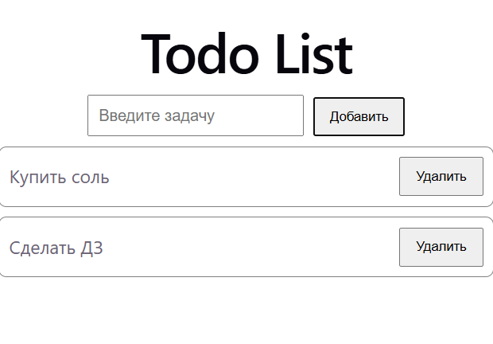

# React Todo List

Простой Todo List, созданный на React + Vite.

Проект сделан для практики работы с React, состоянием, формами и массивами.

## 🌐 Демо

https://react-todo-list-sand-eight.vercel.app

## 🚀 Возможности

- Добавление новых задач
- Отображение списка задач
- Удаление задач
- Управление состоянием через React
- Работа с input
- Адаптивный и простой интерфейс

## 🛠 Технологии

- React
- JavaScript
- HTML
- CSS
- Vite
- Git
- GitHub
- Vercel

## 📸 Скриншот



## 💻 Запуск проекта

Склонируйте репозиторий:

```bash
git clone https://github.com/sanjisadsad-cloud/react-todo-list.git
```

Перейдите в папку проекта:

```bash
cd react-todo-list
```

Установите зависимости:

```bash
npm install
```

Запустите проект:

```bash
npm run dev
```

## 📚 Что я изучил в этом проекте

Во время разработки проекта я использовал:

- `useState`
- `map()`
- `filter()`
- обработчики событий
- controlled input
- работу с массивами
- условный рендеринг
- компоненты React
- работу с Git и GitHub
- деплой проекта на Vercel

## 👨‍💻 Автор

Sanzhar Bekseitov